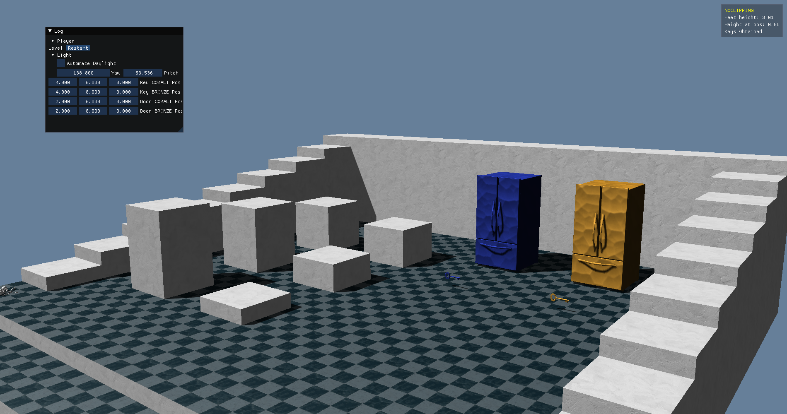
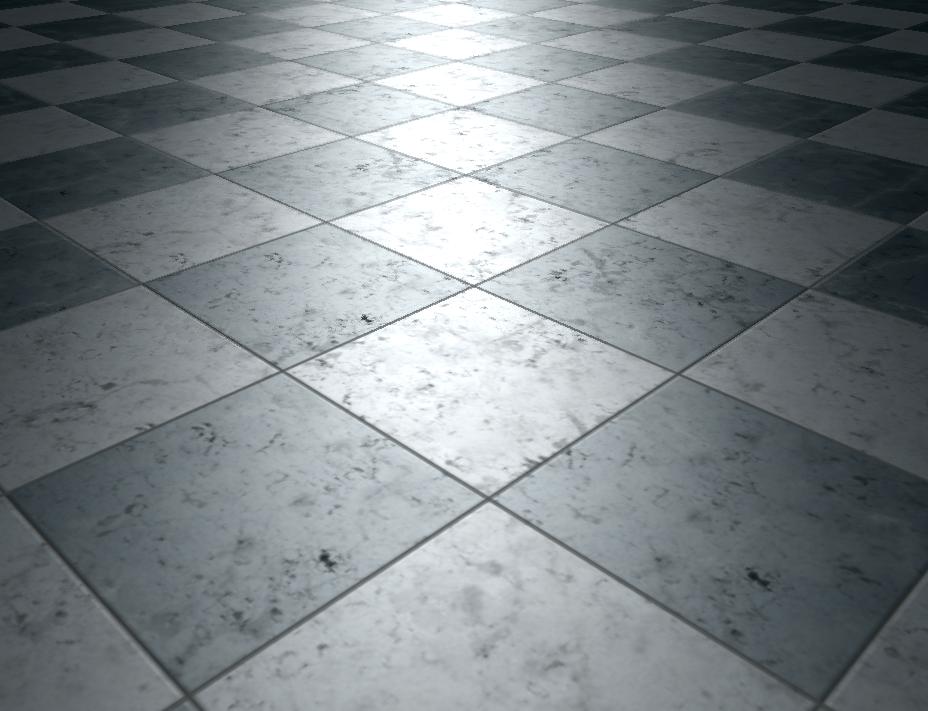
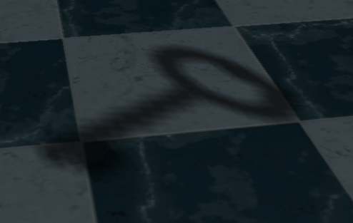
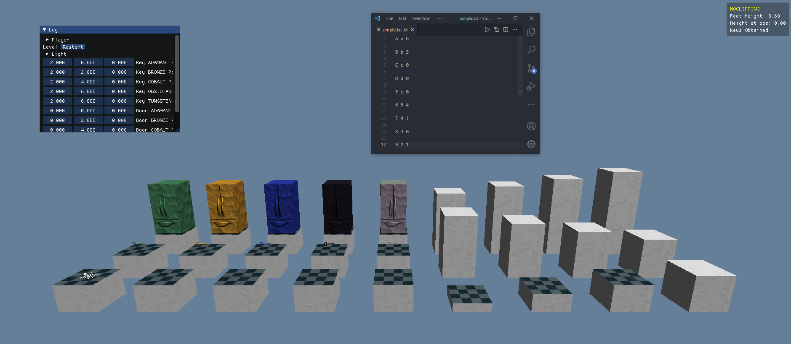

## Compiling
I use Windows and VS. All dependencies are in `src/lib`.   

## Key Features & Images
#### Describe the various key features of your final working system. Show several images of your project working. Highlight the various features with different images. 
[Video](https://www.youtube.com/watch?v=Cgk18eCGDM8)  
This program supports basic heightmap based level creation, where blocks of height 1 through 12 can be placed on a grid. Additionally, up to 5 pairs of doors and keys can be placed, where each corresponding key will open the door. There is a directional light overhead, which illuminates diffuse, specular, and normal mapped surfaces. In addition to these material maps, there is also a shadow map calculated in real time, which casts shadows and updates whenever the directional light changes directions. There is basic movement in the program, which uses heightmap-based collisions with jumping and crouching. 

  

  
This gif shows normal maps working as the light is rotated in a circle on the sky, as different parts of the paint strokes being highlighted and shaded.

  
This picture shows specular maps working as specular highlights from the sun still have shaded spots, despite being in full bright light.

  
This picture shows a more technical side of the shadowmap, where two things can be observed. The first is that the shadows are relatively smooth given the technique, which is achieved through sampling the texture multiple times, and using linear blending. The second is that it's still a shadowmap, you can clearly see the pixelated nature of the shadows.

This picture shows how level text files translate to the program.  

## Progress Description & Overview
#### Describe the overall goal of your project: What were you aiming to accomplish and how much of this goal you actually achieved?
The main goal in a word I wanted to achieve was shadowmaps. Directional shadowmaps are the direct version of this, but I additionally wanted to add point light shadowmaps. After this, I wanted to implement more flexible level creation and mesh generation, which would lead into being able to update the map with the program open (without having to reload anything). The goal here was to do this without regenerating the entire level mesh, mostly for "I did this" reasons than practical ones. 

I achieved directional shadowmaps which were easily updatable in real time, and would track all objects. I achieved this by rendering a depth map from the directional light's perspective, and of course testing against this shadowmap in the fragment shader. This product was a success, it did exactly what I wanted to in the way that I expected to without compromises.

I additionally achieved heightmap based level loading, which went very smoothly. Of course, it wasn't as simple as just smashing my keyboard, but I didn't run into any dead ends. When I had a problem, for example UV mapping with varying texture sizes, or coordinate transforms, or how to iterate in weird scenarios like using the same code for each direction's face direction, these were all things that were solved very directly through what I've learned in the past, and what I've learned in this class.

#### What were they main obstacles you encountered along the way?
Unfortunately, shadowmaps did take a lot more time than I thought it would. This was, in retrospect, because of primarily two issues. The first issue, and one that I learned to solve while working on this leading to a better workflow, is debugging uniforms very explicitly. I created structs for my shaders containing all of the uniform locations, and became very explicit about where these are updated. This can be seen at the top of main.cpp, and makes it very easy to step through logically to see if there are any issues related to this. I didn't do this initially, so if a uniform was incorrect, I was much more blindly trying to find this. 

The second problem I had was just not having a good way to debug textures. I don't know how I would fix this in the future without just giving myself more time, because debugging GPU memory contents isn't easy. It's easy to just render it to the screen, but it isn't that simple with framebuffers, shader flows, and more.  

## Future Work
#### In what ways could your project be extended going forward? 
There are an endless amount of things I want to do going forward. Daniel suggested two techniques I could look into as extensions of shadowmapping, which is a very direct place to go. I mentioned that I want to add point lights, and obviously an arbitrary or large amount of lights. I still want to implement rudimentary realtime editing, updating the buffer by updating subregions of it. I want to add full 3d collisions, rather than basing it off a heightmap technique as I currently do. I want to read the bounding box of .obj files so I don't have to manually set collisions. I want to add bumpmapped surfaces, which is a very distant technique but one that interests me. Immediately, I want to add a skybox. Cubemapping would be fun. Transparent objects are likely possible by adding two lines of code, but it isn't something I've wanted to debug or deal with yet. 
